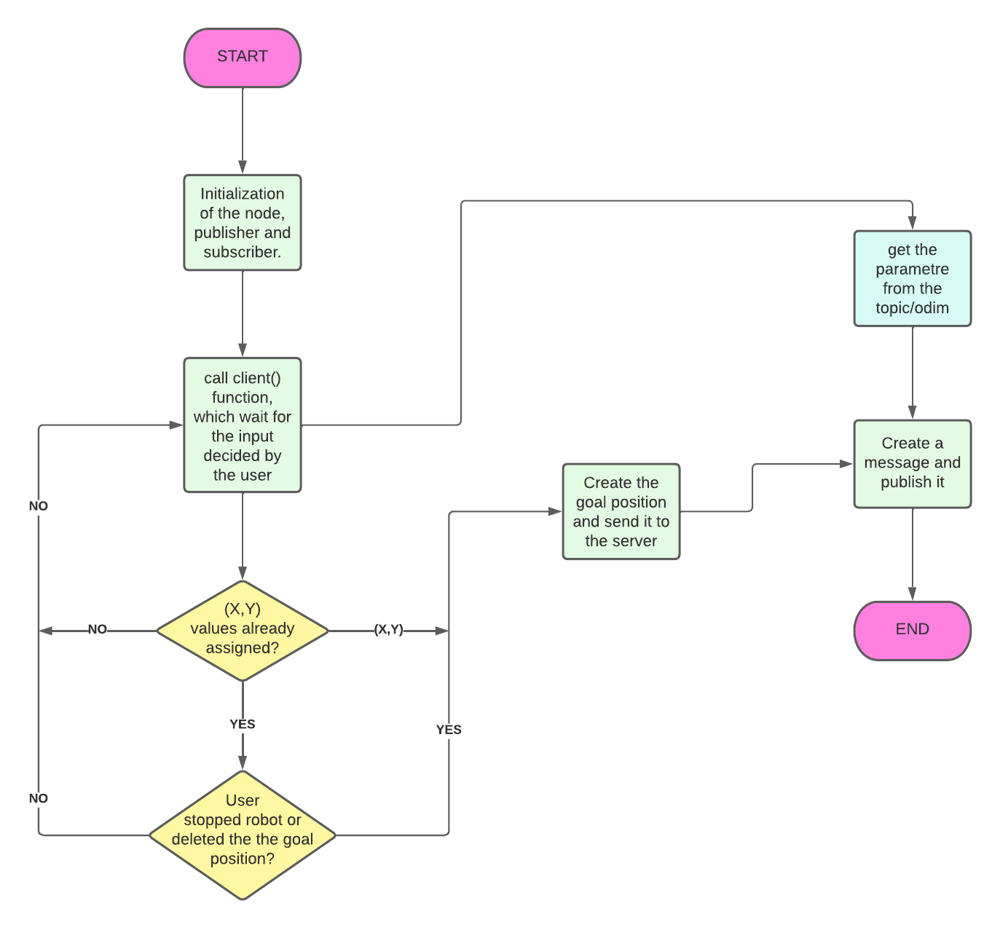

# RT_assignment2

Pisano Davide 4363394

## Description of Second  Assignment

In this second assignment the user is able to control a mobile robot in 3D simulation environment called *Gazebo*. The requests to carry out the assignment are three: 

-The **first** node implement the possibility for the user to set a target desired position of the robot or to stop the robot. 

-The **second** node is a service thar, when called, print the number of positions reached and cancelled.

-The **third** node should print the robot's distance from the goal position and its average speed.

## Nodes's program

In the scripts folder there are six nodes:

- `bug_as.py` is the action server node that gets the desired position from the client and calls the services to bring the robot to the given position. The position is set as a ROS parameter

- `input_user.py` is the action client node that allows the user to set the desired position or to cancel the desired position. It publishes the robot's position and velocity as a message, getting on the values of the /*odom* topic. The funtionality of the node is described in the following flowchart:
  
<figure>

<figcaption align = "center"></figcaption>
</figure>
<br/><br/><br/>

- `info.py` is the node that prints the distance of the robot from the desired position and its average speed, getting them from the */pos_vel* topic as a custom message. The information is printed with the frequency set as a ROS parameter inside of the launch file

- `go_to_point_service.py` is the service node that, when called, makes the robot move toward the desired position, retrieved from the ROS parameter

- `wall_follow_service.py` is the service node that, when called, makes the robot move around an obstacle (a wall, an object...)

- `service.py` is the service node that, when called, prints the number of times a goal has been reached and the number of times a goal has been canceled

## Install and run

First, run the master:

```bash
$ roscore 
```

Then to install the module, you need to go inside the `src` folder of your ROS workspace and run the command:

```bash
$ git clone https://github.com/DavidePisano/-ResearchTrack1--Second-Assignment/tree/main/assignment_2_2022
```

and from the root directory of your ROS workspace run the command:

```bash
$ catkin_make
```

To run the program, install in your system the program **xterm**. To install it:

```bash
$ sudo apt-get install xterm
```

in the end type:

```bash
$ roslaunch assignment_2_2022 assignment1.launch
```

## Possible improvements

This are some possible improvements that could be made to the program for fix and improve it:

- increase the speed of movement and rotation of the robot;

- improve the most optimal path choice possible for the robot, so that it decreases the travel time before arriving at the final position.

- display a marker on the arena representing the desired position.
